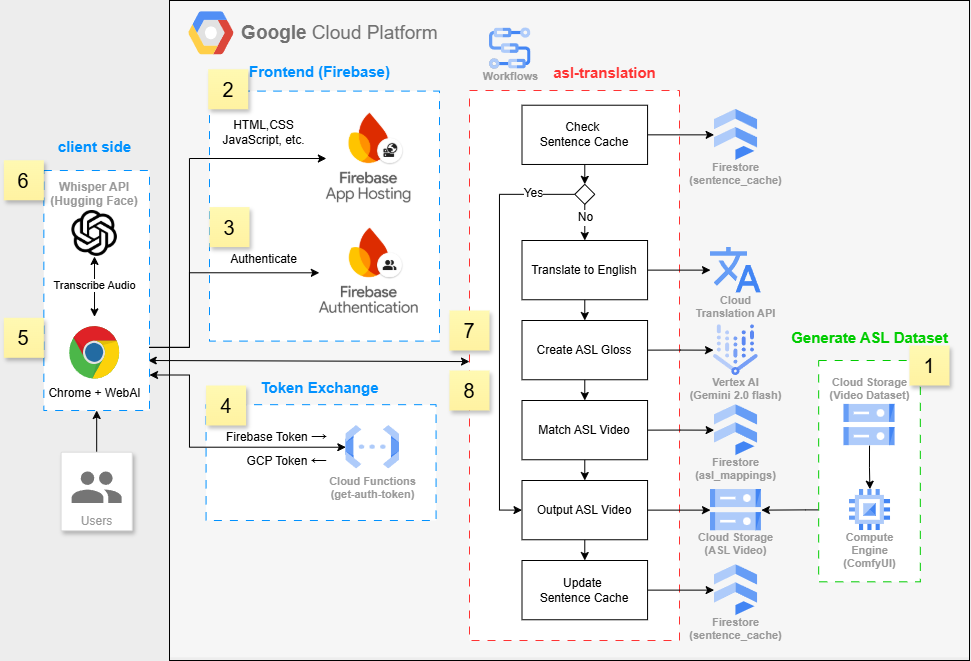

# GenAI-powered Global Sign Language Translator

## Introduction

In today's digital age, effective communication is essential for fostering inclusivity and breaking down barriers. However, for individuals who rely on visual communication methods like American Sign Language (ASL), traditional communication tools often fall short. This is where the GenAI-powered Global Sign Language Translator comes in.

Our innovative solution leverages the power of Gemini 2.0 Flash AI to convert multilingual text and speech into expressive American Sign Language videos within seconds. By bridging the gap between spoken and written language and sign language, we're not just creating a technological solution—we're fostering a more inclusive world where communication barriers no longer create gaps between people.

Sign language is not merely a communication tool but an essential part of deaf culture and identity. Through modern technology, we aim to provide a convenient tool for the general public to communicate easily with the deaf community, promoting social inclusion and enhancing understanding of deaf culture.

**Try it now:** [ASL Translator](https://genasl.web.app/)

## Solution Overview

The GenAI-powered Global Sign Language Translator is a modern web application that accepts multiple types of input—multilingual text, voice recording, and audio file upload—and returns an AI-generated American Sign Language video within 5 seconds. The system supports various features designed to enhance the learning experience, including adjustable playback speeds (0.1x-1x) and loop playback functionality.

At its core, our solution is built around a robust processing pipeline that leverages state-of-the-art AI models and cloud services:

1. **Input Processing**: The system accepts text input directly or converts audio to text using the Whisper API.

2. **AI-Powered Translation**: Gemini 2.0 Flash AI converts the text into ASL gloss notation, which represents the grammatical structure of sign language.

3. **Video Generation**: The system maps the gloss notation to pre-generated video clips and assembles them into a seamless ASL video.

4. **Performance Optimization**: A sophisticated caching mechanism ensures fast response times for repeated translations.

All of this is orchestrated through Google Cloud Platform services, providing a scalable, reliable, and secure solution that can be accessed from any device with a web browser.

## Architecture Details

Our system architecture is built on Google Cloud Platform and follows a numbered workflow as illustrated in the diagram:

**1. Generate ASL Dataset:**
Cloud Storage stores video datasets processed by Compute Engine running ComfyUI, creating the foundation for sign language videos. This batch process currently includes around 2,200 videos using advanced pose estimation techniques, ensuring a comprehensive library of sign language expressions.

**2. Frontend (Firebase):**
HTML/CSS/JavaScript application hosted on Firebase App Hosting, providing the user interface for interaction. Built with React.js and Tailwind CSS, the frontend offers a responsive design that works seamlessly across desktop and mobile devices.

**3. Firebase Authentication:**
Secures user access through anonymous authentication, maintaining privacy while enabling personalized experiences. This allows users to access the service without creating accounts while still providing a secure environment.

**4. Token Exchange:**
Cloud Functions handle the conversion between Firebase tokens and GCP tokens, ensuring secure API access. This critical security layer prevents unauthorized access to the translation services and user data.

**5. Chrome + WebAI:**
Browser-based interface where users interact with the application through text input or audio recording. The interface is designed to be intuitive and accessible, with clear visual feedback during the translation process.

**6. Whisper API:**
Transcribes audio input to text, enabling voice-based interaction with the system. This powerful speech recognition service handles various accents, speech patterns, and background noise conditions.

**7. ASL Translation Workflow:**
Core processing pipeline that:
- Checks sentence cache in Firestore
- Translates non-English text to English using Cloud Translation API
- Creates ASL gloss using Vertex AI (Gemini 2.0 Flash)
- Matches ASL video segments from the database
- Updates the sentence cache for future use
- Outputs the final ASL video

**8. Workflow Connection:**
Secure connection between the frontend and backend workflow, passing authenticated requests for processing. This ensures that all communication between components is encrypted and verified.

This architecture enables seamless translation from text or speech to sign language videos, with performance optimization through caching and cloud-based processing. The modular design allows for easy scaling and future enhancements.

**9. ComfyUI:**  
- ComfyUI is a node-based visual interface used in this project to handle the entire ASL video-generation workflow.  
- **Core Workflow Nodes:**  
  - **Video Loading & Preprocessing**  
    - `VHS_LoadVideoPath`: Imports the source video and adjusts frame rate/resolution  
    - `MiDaS-DepthMapPreprocessor`: Generates a depth map  
    - `DWPreprocessor`: Performs hand and body pose estimation  
  - **Model Loading & Sampling**  
    - `CheckpointLoaderSimpleWithNoiseSelect` + `VAELoader`: Loads the animation model and VAE encoder  
    - `ADE_AnimateDiffLoaderWithContext` + `StandardStaticContextOptions`: Loads the AnimateDiff Evolved model with context options  
    - `KSampler`: Generates latent image sequences using the specified sampler and parameters  
  - **ControlNet Control**  
    - `ControlNetLoaderAdvanced` + `ControlNetApplyAdvanced`: Loads and applies depth and pose ControlNet, adjusting strength and active range  
  - **Intermediate Preview**  
    - `PreviewImage`: Visualizes intermediate depth maps or latent images  
  - **Output Video Composition**  
    - `VHS_VideoCombine`: Combines generated frames into the final ASL video file  
- **Integrated Plugins:**  
  - [ComfyUI-Advanced-ControlNet](https://github.com/Kosinkadink/ComfyUI-Advanced-ControlNet)  
  - [ComfyUI-AnimateDiff-Evolved](https://github.com/Kosinkadink/ComfyUI-AnimateDiff-Evolved)  
  - [comfyui_controlnet_aux](https://github.com/Fannovel16/comfyui_controlnet_aux)  
  - [ComfyUI-VideoHelperSuite](https://github.com/Kosinkadink/ComfyUI-VideoHelperSuite)  

## Technical Implementation

### Core Technologies

Our solution leverages several cutting-edge technologies:

- **Frontend**: React.js with Tailwind CSS for responsive design
- **Cloud Platform**: Google Cloud Platform (GCP)
- **AI Models**:
  - Gemini 2.0 Flash for ASL generation
  - Whisper API for speech recognition
- **Storage Solutions**:
  - Firestore for structured data
  - Cloud Storage for video files
- **Processing Tools**:
  - Cloud Translation API
  - ComfyUI for video processing
  - Cloud Functions for authentication