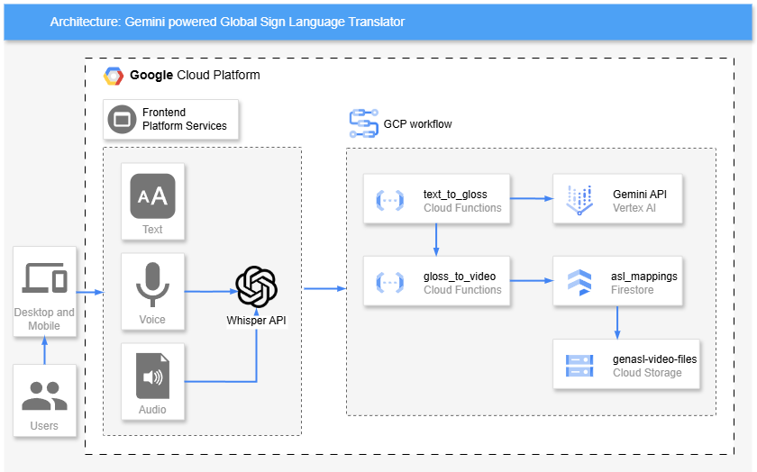

# GenAI-powered Global Sign Language Translator

[English](#genai-powered-global-sign-language-translator-english) | [繁體中文](#基於生成式ai的全球手語翻譯器-繁體中文)

---

# GenAI-powered Global Sign Language Translator (English)

## Table of Contents
- [Introduction](#introduction)
- [Try it](#try-it)
- [System Architecture](#system-architecture)
- [Core Features](#core-features)
- [Workflow](#workflow)
- [Technical Implementation](#technical-implementation)
- [Vision](#vision)

## Introduction

GenAI-powered Global Sign Language Translator is an innovative sign language translation tool designed to break down communication barriers between hearing and deaf communities. By integrating Gemini 2.0 Flash AI model, this tool enables the conversion of multilingual text and speech into American Sign Language (ASL). The system supports various input methods, including text input, voice recording, and audio file upload, generating corresponding sign language videos within 5 seconds. Users can better learn and understand sign language through adjustable playback speeds (0.1x-1x) and loop playback functionality.

In this digital age, communication barriers should not create gaps between people. Sign language is not just a communication tool but an essential part of deaf culture. This project aims to provide a convenient tool for the general public to communicate easily with the deaf community through modern technology. It's not just a technological innovation but an important tool for promoting social inclusion.

## Try it

Visit our website: [ASL Translator](https://storage.googleapis.com/asl-translator-website/index.html)

## System Architecture

### Architecture Overview
1. **Frontend Layer**
   - Chrome browser access
   - Text, voice, and audio file input support
   - React.js-based responsive interface

2. **Speech Processing Layer**
   - OpenAI Whisper via Hugging Face
   - Multiple voice input format support

3. **Core Processing Layer**
   - Text-to-Gloss Function:
     * Language detection and translation
     * Sign language generation
   - Gloss-to-Video Function:
     * Video mapping and URL generation

4. **Data Storage Layer**
   - Firestore: Sign language mapping storage
   - Cloud Storage: Video file storage

## Core Features

### System Features
- **Quick Response**: 5-second translation and video generation
- **Multilingual Support**: Automatic language detection
- **Accurate Translation**: AI-powered sign language conversion
- **Reliable Service**: Cloud-based stability

### Input Features
- **Multilingual Text Input**: Real-time input support
- **Voice Recording**: 10-second voice input
- **Audio File Upload**: File processing support

### Video Playback Features
- **Speed Control**: 0.1x-1x adjustable speed
- **Loop Playback**: Learning support
- **Playback Control**: Full video controls
- **Progress Display**: Real-time progress

## Workflow

### Process Flow
1. **Input Processing**
   - User input handling
   - Voice-to-text conversion

2. **Language Processing**
   - Language detection
   - English conversion

3. **Sign Language Generation**
   - AI-based symbol generation
   - Expression optimization

4. **Video Matching**
   - Database query
   - URL generation

5. **Result Display**
   - Video combination
   - Interface controls

## Technical Implementation

### Core Technologies
- **AI Model**: Gemini 2.0 Flash AI
- **Speech Recognition**: OpenAI Whisper
- **Language Service**: Google Cloud Translation
- **Data Storage**: Google Cloud Platform
- **Frontend**: React.js

### Service Components
1. **Text-to-Gloss Service**
   - Language processing
   - Sign generation
   - Error handling

2. **Gloss-to-Video Service**
   - Video management
   - Access optimization
   - URL handling

## Vision

This project is not just a technical solution but a social innovation initiative. Through this tool, we aim to:

1. Reduce communication barriers and promote social inclusion
2. Provide convenient sign language learning tools
3. Enhance understanding of deaf culture
4. Promote technology-enabled social equality

---

# 基於生成式AI的全球手語翻譯器 (繁體中文)

## 目錄
- [項目簡介](#項目簡介-1)
- [立即體驗](#立即體驗)
- [系統架構](#系統架構)
- [核心功能](#核心功能)
- [工作流程](#工作流程)
- [技術實現](#技術實現)
- [項目願景](#項目願景)

## 項目簡介

基於生成式AI的全球手語翻譯器是一個創新的手語翻譯工具，旨在打破聽障人士與普通人之間的溝通障礙。通過整合Gemini 2.0 Flash AI模型，該工具能夠實現多語言文本和語音到美國手語（ASL）的轉換。系統支持多種輸入方式，包括文本輸入、語音錄製和音頻文件上傳，並在5秒內生成對應的手語視頻。用戶可以通過可調節的播放速度（0.1x-1x）和循環播放功能，更好地學習和理解手語。

在這個數字時代，溝通的障礙不應該成為人與人之間的隔閡。手語不僅是一種溝通工具，更是聾啞人士文化身份的重要組成部分。本項目旨在通過現代科技，為普通人提供一個便捷的工具，讓他們能夠輕鬆地與聾啞人士進行交流。這不僅是一個科技創新，更是促進社會共融的重要工具，期望能為聾健社群之間搭建一座雙向互動的溝通橋樑。

## 立即體驗

訪問我們的網站：[ASL Translator](https://storage.googleapis.com/asl-translator-website/index.html)

## 系統架構

### 架構說明
1. **用戶界面層**
   - Chrome瀏覽器訪問
   - 支持文本、語音和音頻輸入
   - 基於React.js的響應式界面

2. **語音處理層**
   - OpenAI Whisper處理
   - 多種語音格式支持

3. **核心處理層**
   - 文本轉手語功能：
     * 語言檢測和翻譯
     * 手語符號生成
   - 手語轉視頻功能：
     * 視頻映射和URL生成

4. **數據存儲層**
   - Firestore：手語映射存儲
   - Cloud Storage：視頻文件存儲

## 核心功能

### 系統特點
- **快速響應**：5秒內完成處理
- **多語言支持**：自動語言檢測
- **準確翻譯**：AI驅動的轉換
- **穩定可靠**：雲端服務保障

### 輸入功能
- **多語言文本**：實時輸入支持
- **語音錄製**：10秒語音輸入
- **文件上傳**：音頻處理支持

### 視頻播放功能
- **速度調節**：0.1x-1x可調
- **循環播放**：學習輔助
- **播放控制**：完整控制項
- **進度顯示**：實時更新

## 工作流程

### 處理流程
1. **輸入處理**
   - 用戶輸入處理
   - 語音轉文本

2. **語言處理**
   - 語言檢測
   - 英語轉換

3. **手語生成**
   - AI符號生成
   - 表達優化

4. **視頻匹配**
   - 數據庫查詢
   - URL生成

5. **結果展示**
   - 視頻組合
   - 界面控制

## 技術實現

### 核心技術
- **AI模型**：Gemini 2.0 Flash AI
- **語音識別**：OpenAI Whisper
- **語言服務**：Google Cloud Translation
- **數據存儲**：Google Cloud Platform
- **前端框架**：React.js

### 服務組件
1. **文本轉手語服務**
   - 語言處理
   - 符號生成
   - 錯誤處理

2. **手語轉視頻服務**
   - 視頻管理
   - 訪問優化
   - URL處理

## 項目願景

本項目不僅僅是一個技術解決方案，更是一次社會創新的嘗試。我們期望通過這個工具：

1. 降低溝通障礙，促進社會包容
2. 提供便捷的手語學習工具
3. 增進對聾啞人士文化的理解
4. 推動科技賦能社會平等
