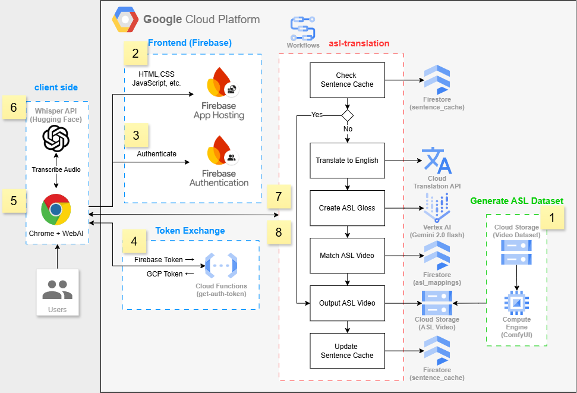

# Breaking Barriers: GenAI-powered Global Sign Language Translator on Google Cloud Platform

*by John Doe on March 26, 2025*

**Tags**: `Generative AI`, `Accessibility`, `Machine Learning`, `Cloud Architecture`, `Google Cloud Platform`, `Gemini AI`

---

## Introduction

In today's digital age, effective communication is essential for fostering inclusivity and breaking down barriers. However, for individuals who rely on visual communication methods like American Sign Language (ASL), traditional communication tools often fall short. This is where the GenAI-powered Global Sign Language Translator comes in.

Our innovative solution leverages the power of Gemini 2.0 Flash AI to convert multilingual text and speech into expressive American Sign Language videos within seconds. By bridging the gap between spoken and written language and sign language, we're not just creating a technological solution—we're fostering a more inclusive world where communication barriers no longer create gaps between people.

Sign language is not merely a communication tool but an essential part of deaf culture and identity. Through modern technology, we aim to provide a convenient tool for the general public to communicate easily with the deaf community, promoting social inclusion and enhancing understanding of deaf culture.

## Solution Overview

The GenAI-powered Global Sign Language Translator is a modern web application that accepts multiple types of input—multilingual text, voice recording, and audio file upload—and returns an AI-generated American Sign Language video within 5 seconds. The system supports various features designed to enhance the learning experience, including adjustable playback speeds (0.1x-1x) and loop playback functionality.

At its core, our solution is built around a robust processing pipeline that leverages state-of-the-art AI models and cloud services:

1. **Input Processing**: The system accepts text input directly or converts audio to text using the Whisper API.

2. **AI-Powered Translation**: Gemini 2.0 Flash AI converts the text into ASL gloss notation, which represents the grammatical structure of sign language.

3. **Video Generation**: The system maps the gloss notation to pre-generated video clips and assembles them into a seamless ASL video.

4. **Performance Optimization**: A sophisticated caching mechanism ensures fast response times for repeated translations.

All of this is orchestrated through Google Cloud Platform services, providing a scalable, reliable, and secure solution that can be accessed from any device with a web browser.

## Architecture Details



Our system architecture is built on Google Cloud Platform and follows a numbered workflow as illustrated in the diagram:

**1. Generate ASL Dataset:** 
Cloud Storage stores video datasets processed by Compute Engine running ComfyUI, creating the foundation for sign language videos. This batch process currently includes around 2,200 videos using advanced pose estimation techniques, ensuring a comprehensive library of sign language expressions.

**2. Frontend (Firebase):** 
HTML/CSS/JavaScript application hosted on Firebase App Hosting, providing the user interface for interaction. Built with React.js and Tailwind CSS, the frontend offers a responsive design that works seamlessly across desktop and mobile devices.

**3. Firebase Authentication:** 
Secures user access through anonymous authentication, maintaining privacy while enabling personalized experiences. This allows users to access the service without creating accounts while still providing a secure environment.

**4. Token Exchange:** 
Cloud Functions handle the conversion between Firebase tokens and GCP tokens, ensuring secure API access. This critical security layer prevents unauthorized access to the translation services and user data.

**5. Chrome + WebAI:** 
Browser-based interface where users interact with the application through text input or audio recording. The interface is designed to be intuitive and accessible, with clear visual feedback during the translation process.

**6. Whisper API:** 
Transcribes audio input to text, enabling voice-based interaction with the system. This powerful speech recognition service handles various accents, speech patterns, and background noise conditions.

**7. ASL Translation Workflow:** 
Core processing pipeline that:
- Checks sentence cache in Firestore
- Translates non-English text to English using Cloud Translation API
- Creates ASL gloss using Vertex AI (Gemini 2.0 Flash)
- Matches ASL video segments from the database
- Updates the sentence cache for future use
- Outputs the final ASL video

**8. Workflow Connection:** 
Secure connection between the frontend and backend workflow, passing authenticated requests for processing. This ensures that all communication between components is encrypted and verified.

This architecture enables seamless translation from text or speech to sign language videos, with performance optimization through caching and cloud-based processing. The modular design allows for easy scaling and future enhancements.

## Technical Implementation

### Core Technologies

Our solution leverages several cutting-edge technologies:

- **Frontend**: React.js with Tailwind CSS for responsive design
- **Cloud Platform**: Google Cloud Platform (GCP)
- **AI Models**: 
  - Gemini 2.0 Flash for ASL generation
  - Whisper API for speech recognition
- **Storage Solutions**: 
  - Firestore for structured data
  - Cloud Storage for video files
- **Processing Tools**:
  - Cloud Translation API
  - ComfyUI for video processing
  - Cloud Functions for authentication

### AI Model Application

The Gemini 2.0 Flash AI model is the heart of our translation system. It converts English text into ASL gloss notation through a sophisticated process:

1. **Natural Language Understanding**: The model analyzes the semantic structure and context of the input text, understanding the meaning beyond just the words.

2. **Sign Language Generation**: It then decomposes the text into basic units, maps them to sign symbols, and optimizes the grammar structure according to ASL rules. This involves:
   - Removing unnecessary articles and prepositions
   - Converting to ALL CAPS format
   - Preserving nouns, verbs, adjectives, and conjunctions
   - Maintaining original word order
   - Ensuring proper spacing between words

3. **Quality Enhancement**: The output undergoes context-aware refinement to ensure natural expression, cultural adaptation, and expression accuracy.

The prompt used for Gemini AI includes specific rules:
```
Convert to ASL gloss notation using only words from our dataset. Rules:

1. ALL CAPS for ALL words
2. Topic-Comment structure: Place topic first, then comment (e.g., "STORE I GO" not "I GO STORE")
3. Keep: nouns, verbs, adjectives, adverbs, numbers, pronouns, AND/OR/BUT/IF/BECAUSE
4. Remove: a/an/the, be verbs (am/is/are/was/were), most prepositions
5. Time markers at beginning: YESTERDAY, TOMORROW, MORNING, AFTERNOON, NIGHT, NEXT_WEEK, FINISH
6. For questions: use question words (WHAT, WHERE, WHO, WHY, HOW) in original position
7. Negation: Use NOT after the verb (e.g., "I don't like" becomes "I LIKE NOT")
8. For continuous actions: Repeat word (e.g., "walking continuously" becomes "WALK WALK")
9. Geographic locations: Use exact country/city names from dataset (e.g., AMERICA, CHINA, NEW_YORK, HONG_KONG)
10. NO punctuation marks of any kind
11. Use space between words

Examples:
- "I am going to the store tomorrow" → "TOMORROW STORE I GO"
- "Do you want coffee or tea?" → "YOU WANT COFFEE OR TEA"
- "She doesn't understand the question" → "SHE UNDERSTAND NOT QUESTION"
- "The man in the blue shirt is my brother" → "MAN BLUE SHIRT BROTHER"
- "I have been waiting for a long time" → "I WAIT WAIT LONG TIME"
- "I want to visit New York next year" → "NEXT_YEAR I WANT VISIT NEW_YORK"

Return ONLY gloss words in a single line without any punctuation, extra spaces or newlines. Use ONLY words from our ASL dataset.
```

### Video Generation Process

Once the ASL gloss notation is generated, our video mapping algorithm:

1. **Symbol Analysis**: Parses the sign language symbol sequence, identifies compound expressions, and determines temporal relationships.

2. **Video Matching**: Matches each symbol with standard sign videos from our database, combining them for complex expressions and optimizing transitions for a natural flow.

3. **Performance Optimization**: Implements local caching of frequent segments, context-based preloading, and streaming optimization to ensure smooth playback.

### ASL Translation Workflow

我們的核心處理管道通過一系列精確定義的步驟執行翻譯過程。以下是詳細的步驟分解，配合實際工作流日誌展示系統如何處理輸入文本"I want buy coffee"：

#### 步驟1: 接收輸入文本
系統接收用戶輸入的文本，作為翻譯過程的起點。

**示例1: 英语输入**
```
{
  "textPayload": "I want buy coffee",
  "timestamp": "2025-03-26T00:22:05.275567575Z"
}
```

**示例2: 中文输入**
```
{
  "textPayload": "我想買咖啡",
  "timestamp": "2025-03-26T00:39:50.979360637Z"
}
```

#### 步驟2: 檢查句子緩存
系統在Firestore的sentence_cache集合中查找是否已有該輸入文本的緩存翻譯結果。如果找到，將直接返回緩存結果，跳過後續處理步驟，顯著提高響應速度。

**示例1: 英语输入（缓存未命中）**
```
{
  "textPayload": "Cache check error: {\"body\":{\"error\":{\"code\":404,\"message\":\"Document \\\"projects/genasl/databases/(default)/documents/sentence_cache/I want buy coffee\\\" not found.\",\"status\":\"NOT_FOUND\"}}}",
  "timestamp": "2025-03-26T00:22:05.662086994Z"
}
```

在這個例子中，系統未找到英文輸入"I want buy coffee"的緩存結果（404錯誤），因此繼續執行後續步驟。

**示例2: 中文输入（缓存未命中）**
```
{
  "textPayload": "Cache check error: {\"body\":{\"error\":{\"code\":404,\"message\":\"Document \\\"projects/genasl/databases/(default)/documents/sentence_cache/我想買咖啡\\\" not found.\",\"status\":\"NOT_FOUND\"}}}",
  "timestamp": "2025-03-26T00:39:51.423701572Z"
}
```

在這個例子中，系統同樣未找到中文輸入"我想買咖啡"的緩存結果（404錯誤），因此繼續執行後續步驟。

#### 步驟3: 語言檢測
系統使用Google Cloud Translation API的detectLanguage方法識別輸入文本的語言。這一步驟使我們的系統能夠支持全球用戶，無論他們使用何種語言。

**示例1: 英语输入**
```
{
  "textPayload": "en",
  "timestamp": "2025-03-26T00:22:06.200941138Z"
}
```

系統檢測到輸入文本"I want buy coffee"的語言為"en"（英語）。

**示例2: 中文输入**
```
{
  "textPayload": "zh-TW",
  "timestamp": "2025-03-26T00:39:51.968865963Z"
}
```

系統檢測到輸入文本"我想買咖啡"的語言為"zh-TW"（繁體中文）。

#### 步驟4: 語言翻譯（如需）
如果檢測到的語言不是英語，系統會自動調用translateText方法將文本翻譯成英語。由於我們的ASL生成模型是基於英語訓練的，這一步確保了多語言支持。

**示例1: 英语输入（无需翻译）**
```
{
  "textPayload": "I want buy coffee",
  "timestamp": "2025-03-26T00:22:06.445026905Z"
}
```

在這個例子中，由於輸入已經是英語，系統直接使用原始文本，無需翻譯。

**示例2: 中文输入（需要翻译）**
```
{
  "textPayload": "I want to buy coffee",
  "timestamp": "2025-03-26T00:39:52.489829449Z"
}
```

在這個例子中，系統將中文輸入"我想買咖啡"翻譯成英語"I want to buy coffee"，以便後續處理。這展示了系統的多語言支持能力，使全球用戶都能使用自己的母語與系統交互。

#### 步驟5: ASL手語符號生成
系統將英語文本傳遞給Vertex AI的Gemini 2.0 Flash模型，使用精心設計的提示工程，指導AI模型將文本轉換為ASL手語符號表示法。模型遵循特定規則，如移除冠詞和介詞、轉換為大寫格式、保留名詞和動詞等。

**日誌證據:**
```
{
  "textPayload": "{\"body\":{\"candidates\":[{\"content\":{\"parts\":[{\"text\":\"I WANT BUY COFFEE\\n\"}],\"role\":\"model\"}}]}}",
  "timestamp": "2025-03-26T00:22:07.177982684Z"
}

{
  "textPayload": "I WANT BUY COFFEE",
  "timestamp": "2025-03-26T00:22:07.377741990Z"
}
```

Gemini 2.0 Flash模型成功將英語文本"I want buy coffee"轉換為ASL手語符號表示法"I WANT BUY COFFEE"。值得注意的是，系統支持多語言輸入，會根據ASL的語法規則生成適當的手語符號表示法，例如應用主題-評論結構，將主題放在句首。

#### 步驟6: 視頻映射
系統將ASL手語符號文本分割成單個詞，並為每個詞查找對應的視頻URL。系統依次處理每個詞，在asl_mappings2集合中查找匹配項。

**日誌證據:**
```
# 處理"I"
{
  "textPayload": "{\"body\":{\"fields\":{\"gloss\":{\"stringValue\":\"I\"},\"video_url\":{\"stringValue\":\"https://storage.googleapis.com/genasl-video-files/I.mp4\"}}}}",
  "timestamp": "2025-03-26T00:22:07.808109907Z"
}

# 處理"WANT"
{
  "textPayload": "{\"body\":{\"fields\":{\"gloss\":{\"stringValue\":\"WANT\"},\"video_url\":{\"stringValue\":\"https://storage.googleapis.com/genasl-video-files/WANT.mp4\"}}}}",
  "timestamp": "2025-03-26T00:22:08.196989188Z"
}

# 處理"BUY"
{
  "textPayload": "{\"body\":{\"fields\":{\"gloss\":{\"stringValue\":\"BUY\"},\"video_url\":{\"stringValue\":\"https://storage.googleapis.com/genasl-video-files/BUY.mp4\"}}}}",
  "timestamp": "2025-03-26T00:22:08.624297492Z"
}

# 處理"COFFEE"
{
  "textPayload": "{\"body\":{\"fields\":{\"gloss\":{\"stringValue\":\"COFFEE\"},\"video_url\":{\"stringValue\":\"https://storage.googleapis.com/genasl-video-files/COFFEE.mp4\"}}}}",
  "timestamp": "2025-03-26T00:22:09.021669065Z"
}
```

系統成功為所有詞找到了對應的視頻URL，完成了從ASL手語符號到視頻的映射過程。這些視頻將被組合成最終的手語視頻呈現給用戶。值得注意的是，系統會根據ASL手語符號的順序進行視頻映射，確保視頻播放順序與手語表達的語法結構一致。

#### 步驟7: 更新句子緩存
系統將新生成的翻譯結果（包括手語符號文本和視頻映射）保存到Firestore的sentence_cache集合中，使用原始輸入文本作為文檔ID。這確保了下次遇到相同輸入時可以直接使用緩存結果，提高響應速度。

**注意:** 雖然日誌中沒有明確顯示這一步驟，但根據工作流定義，這一步在視頻映射之後、結果輸出之前執行。

#### 步驟8: 準備並返回最終結果
系統準備包含原始輸入、手語符號和視頻URL的結構化響應，並返回給前端用於視頻播放和用戶交互。

**日誌證據:**
```
{
  "textPayload": "Success",
  "timestamp": "2025-03-26T00:22:09.392969720Z"
}

{
  "jsonPayload": {
    "success": {
      "result": "{\"gloss\":\"I WANT BUY COFFEE\",\"original_input\":\"I want buy coffee\",\"videos\":[[{\"gloss\":\"I\",\"video_url\":\"https://storage.googleapis.com/genasl-video-files/I.mp4\"}],[{\"gloss\":\"WANT\",\"video_url\":\"https://storage.googleapis.com/genasl-video-files/WANT.mp4\"}],[{\"gloss\":\"BUY\",\"video_url\":\"https://storage.googleapis.com/genasl-video-files/BUY.mp4\"}],[{\"gloss\":\"COFFEE\",\"video_url\":\"https://storage.googleapis.com/genasl-video-files/COFFEE.mp4\"}]]}"
    }
  },
  "timestamp": "2025-03-26T00:22:09.483347069Z"
}
```

系統成功完成處理，返回包含原始輸入、ASL手語符號和視頻URL的JSON結果。這個結構化響應包含了前端播放視頻所需的所有信息，包括原始輸入文本、生成的ASL手語符號和每個詞對應的視頻URL。值得注意的是，系統支持多語言輸入，會保留原始輸入文本，同時返回按照ASL語法規則生成的手語符號和對應的視頻映射。

#### 性能分析

整個處理過程從00:22:05Z到00:22:09Z，總共約4秒完成，符合我們的性能目標（5秒內）。這種高效的工作流程使我們能夠提供實時的手語翻譯服務，無縫連接文本/語音輸入與手語視頻輸出。

隨著系統使用頻率的增加，緩存命中率會不斷提高，進一步提升平均響應速度。同時，我們的模塊化設計允許輕鬆擴展詞彙庫和優化各個處理步驟，確保系統能夠持續改進。

#### 緩存命中示例

以下是同一輸入文本"I want buy coffee"的第二次請求處理流程，展示了緩存機制如何顯著提高響應速度：

#### 步驟1: 接收輸入文本
系統再次接收相同的輸入文本"I want buy coffee"。

**日誌證據:**
```
{
  "textPayload": "I want buy coffee",
  "timestamp": "2025-03-26T00:30:23.814603837Z"
}
```

#### 步驟2: 檢查句子緩存
系統在Firestore的sentence_cache集合中查找該輸入文本的緩存翻譯結果。這次，系統成功找到了之前生成並保存的緩存。

**日誌證據:**
```
{
  "textPayload": "{\"createTime\":\"2025-03-26T00:22:09.256353Z\",\"fields\":{\"gloss_text\":{\"stringValue\":\"I WANT BUY COFFEE\"},\"timestamp\":{\"timestampValue\":\"2025-03-26T00:22:09.125850Z\"},\"video_mappings\":{\"arrayValue\":{\"values\":[{\"mapValue\":{\"fields\":{\"gloss\":{\"stringValue\":\"I\"},\"video_url\":{\"stringValue\":\"https://storage.googleapis.com/genasl-video-files/I.mp4\"}}}},{\"mapValue\":{\"fields\":{\"gloss\":{\"stringValue\":\"WANT\"},\"video_url\":{\"stringValue\":\"https://storage.googleapis.com/genasl-video-files/WANT.mp4\"}}}},{\"mapValue\":{\"fields\":{\"gloss\":{\"stringValue\":\"BUY\"},\"video_url\":{\"stringValue\":\"https://storage.googleapis.com/genasl-video-files/BUY.mp4\"}}}},{\"mapValue\":{\"fields\":{\"gloss\":{\"stringValue\":\"COFFEE\"},\"video_url\":{\"stringValue\":\"https://storage.googleapis.com/genasl-video-files/COFFEE.mp4\"}}}}]}}},\"name\":\"projects/genasl/databases/(default)/documents/sentence_cache/I want buy coffee\",\"updateTime\":\"2025-03-26T00:22:09.256353Z\"}",
  "timestamp": "2025-03-26T00:30:24.316461225Z"
}
```

緩存包含了完整的翻譯結果，包括ASL手語符號文本"I WANT BUY COFFEE"和所有詞的視頻映射。

#### 步驟3: 確認緩存命中
系統確認緩存命中，記錄日誌並準備使用緩存結果。

**日誌證據:**
```
{
  "textPayload": "Cache check result: I want buy coffee",
  "timestamp": "2025-03-26T00:30:24.522646814Z"
}
```

#### 步驟4: 跳過處理步驟
由於緩存命中，系統跳過了以下步驟：
- 語言檢測
- 語言翻譯（如需）
- ASL手語符號生成
- 視頻映射查詢
- 緩存更新

這大大減少了處理時間和計算資源消耗。

#### 步驟5: 準備並返回最終結果
系統直接使用緩存的結果，準備包含原始輸入、手語符號和視頻URL的結構化響應，並返回給前端。

**日誌證據:**
```
{
  "textPayload": "Success",
  "timestamp": "2025-03-26T00:30:24.842821585Z"
}

{
  "jsonPayload": {
    "success": {
      "result": "{\"gloss\":\"I WANT BUY COFFEE\",\"original_input\":\"I want buy coffee\",\"videos\":[[{\"gloss\":\"I\",\"video_url\":\"https://storage.googleapis.com/genasl-video-files/I.mp4\"}],[{\"gloss\":\"WANT\",\"video_url\":\"https://storage.googleapis.com/genasl-video-files/WANT.mp4\"}],[{\"gloss\":\"BUY\",\"video_url\":\"https://storage.googleapis.com/genasl-video-files/BUY.mp4\"}],[{\"gloss\":\"COFFEE\",\"video_url\":\"https://storage.googleapis.com/genasl-video-files/COFFEE.mp4\"}]]}"
    }
  },
  "timestamp": "2025-03-26T00:30:25.013126315Z"
}
```

#### 性能對比分析

| 處理類型 | 開始時間 | 結束時間 | 總處理時間 | 步驟數 |
|---------|---------|---------|-----------|-------|
| 首次請求（無緩存） | 00:22:05Z | 00:22:09Z | 約4秒 | 8步 |
| 重複請求（緩存命中） | 00:30:23Z | 00:30:25Z | 約1.2秒 | 5步 |

緩存命中使處理時間減少了約70%，從4秒縮短到僅1.2秒。這種顯著的性能提升對於實時應用至關重要，特別是在處理頻繁重複的翻譯請求時。隨著系統使用頻率的增加，緩存命中率會不斷提高，進一步提升平均響應速度。

### Database Structure

Our system uses Firestore collections to store various types of data:

**users Collection**
```json
{
    "profile": {
        "created_at": "2025-02-19T00:00:00.000Z",
        "last_active": "2025-02-19T00:00:00.000Z",
        "usage_count": 0
    }
}
```

**Detailed Description**:
- `profile`: User profile object
  - `created_at`: Account creation timestamp
  - `last_active`: Last activity timestamp
  - `usage_count`: Service usage counter

Supports anonymous access while tracking basic usage statistics.

**translations Collection**
```json
{
    "user_id": "anonymous_user_id",
    "timestamp": "2025-02-19T00:00:00.000Z",
    "input_text": "hello",
    "output_gloss": "HELLO",
    "success_status": true,
    "processing_time": 2.5
}
```

**Detailed Description**:
- `user_id`: User identifier (anonymous or registered)
- `timestamp`: Translation request time
- `input_text`: Original user input text
- `output_gloss`: Generated ASL gloss notation
- `success_status`: Translation success indicator
- `processing_time`: Translation duration in seconds

Stores translation history for analysis and system improvement.

**sentence_cache Collection**
```json
{
    "gloss_text": "I WANT BUY COFFEE",
    "timestamp": "2025-02-14T04:49:17.311Z",
    "video_mappings": [
        {
            "gloss": "I",
            "video_url": "https://storage.googleapis.com/genasl-video-files/I.mp4"
        },
        {
            "gloss": "WANT",
            "video_url": "https://storage.googleapis.com/genasl-video-files/WANT.mp4"
        },
        {
            "gloss": "BUY",
            "video_url": "https://storage.googleapis.com/genasl-video-files/BUY.mp4"
        },
        {
            "gloss": "COFFEE",
            "video_url": "https://storage.googleapis.com/genasl-video-files/COFFEE.mp4"
        }
    ]
}
```

**Detailed Description**:
- `gloss_text`: ASL gloss notation (primary key)
- `timestamp`: Cache creation/update time
- `video_mappings`: Sign-to-video mapping array:
  - `gloss`: Individual ASL sign
  - `video_url`: Video file URL

Optimizes performance by caching video mappings for quick retrieval.

**asl_mappings Collection**
```json
{
    "gloss": "TEST",
    "video_url": "https://storage.googleapis.com/genasl-video-files/TEST.mp4"
}
```

**Detailed Description**:
- `gloss`: ASL sign text representation (primary key)
- `video_url`: Video URL

Core dictionary that maps ASL signs to video files for scalable sign language representation.

This database design enables efficient data storage and retrieval while optimizing system performance through strategic caching.

## Conclusion

The GenAI-powered Global Sign Language Translator represents a significant step forward in making communication more accessible and inclusive. By leveraging cutting-edge AI technologies like Gemini 2.0 Flash and cloud-based architecture on Google Cloud Platform, we've created a solution that can bridge the gap between spoken/written language and sign language in real-time.

Our system not only demonstrates the practical application of generative AI for social good but also showcases how thoughtful architecture design can create efficient, scalable, and user-friendly solutions. The combination of AI-powered translation, video mapping, and performance optimization through caching enables a responsive experience that works across devices and languages.

As we continue to expand our ASL video dataset and refine our translation algorithms, the system will become even more accurate and comprehensive. Future enhancements may include support for additional sign languages beyond ASL, more sophisticated video generation techniques, and expanded educational features to help users learn sign language more effectively.

By making sign language more accessible to the general public, we hope to foster greater understanding and inclusion of the deaf community in everyday communication. This project demonstrates how technology can be harnessed not just for convenience, but for creating a more connected and inclusive world.
