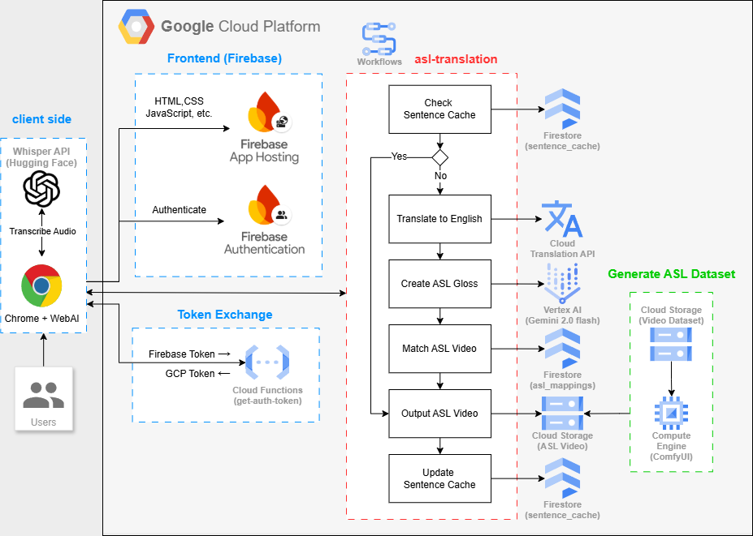

# Overcoming Barriers: The GenAI Global Sign Language Translator Powered by Google Cloud Platform and Gemini AI

*by [Your Name] on [Publication Date]*

**Tags**: `Generative AI`, `Accessibility`, `Machine Learning`, `Cloud Architecture`

---

## Introduction

In today's digital age, fostering inclusive communication is more important than ever. Unfortunately, many traditional tools fail to meet the needs of the Deaf and Hard of Hearing communities. The GenAI Global Sign Language Translator addresses this gap by swiftly converting text and speech into sign language videos, enabling users to communicate in real time and access information more easily. In this post, we will explore the project's architecture, highlight its key features, and delve into the technical implementation, providing detailed insights directly from its source code.

## Solution Overview

The translator is a modern web application that accepts multiple types of input—multilingual text, real-time audio streaming, and recorded audio files—and returns an AI-generated American Sign Language (ASL) video. The system is built around a robust processing pipeline that leverages state-of-the-art AI models (such as **Gemini 2.0 Flash**) for text-to-gloss conversion and custom services for mapping gloss notation to sign language videos.

## Architecture



Our solution leverages the robust infrastructure of Google Cloud Platform (GCP) to ensure high performance and scalability. Here's an overview of the architecture:

- **ASL Dataset Generation**:
  - Cloud Storage holds sign language video clips pre-generated via Compute Engine (ComfyUI).

- **Frontend Distribution**:
  - Firebase App Hosting delivers the web app (HTML/CSS/JS) quickly to users.

- **User Authentication**:
  - Firebase Authentication provides secure, anonymous login.

- **Token Exchange**:
  - A Cloud Function converts Firebase tokens into GCP tokens for secure access to cloud services.

- **User Interface**:
  - Users interact through a Chrome-based interface supporting text input, audio recording, and file uploads.

- **Audio Processing**:
  - The Whisper API (via Hugging Face) transcribes audio to text.

- **Backend Processing Initiation**:
  - Processed input (text or transcribed audio) triggers the ASL translation workflow.

- **ASL Translation Workflow**:
  - Checks Firestore for cached translations
  - If missing, translates text to English (if needed)
  - Generates ASL gloss via Vertex AI (Gemini 2.0 Flash)
  - Maps gloss tokens to video clips in Firestore
  - Assembles the video
  - Updates the cache
  - Returns video URL for playback

---

## Batch Process (ComfyUI)

### Overview
This stage is responsible for pre-generating the ASL video assets. Running on Compute Engine with ComfyUI, it handles the intensive task of creating sign language video clips from predefined inputs.

### Key Points

1. **Video Generation**:
   - ComfyUI processes predefined inputs (such as sign language gestures) to generate high-quality video clips.

2. **Compute Resources**:
   - Compute Engine provides the scalable compute power required for rendering these video clips.

3. **Storage**:
   - The generated clips are stored in Cloud Storage
   - This pre-generated video dataset allows the system to quickly retrieve and assemble the appropriate clips during translation

---

## Backend

### Overview
The backend functions as the central orchestrator for the translation workflow. It exclusively receives text input (whether directly entered or transcribed from audio on the frontend) and transforms it into an ASL video.

### Workflow Details

#### Input Reception & Security

- **Text Input Only**:
  - The backend receives only text input from the frontend
  - Text may originate from direct user entry or be the result of audio transcription performed on the frontend

- **Token Exchange**:
  - A Cloud Function handles token exchange
  - Converts Firebase tokens into GCP tokens
  - Ensures secure, authenticated access to all required cloud services

#### ASL Translation Workflow

1. **Cache Check**:
   - System checks Firestore's sentence_cache for existing translations
   - Uses cached result if found to speed up response times

2. **Translation & Gloss Generation**:
   - **Language Translation**:
     - Cloud Translation API converts non-English text into English
   - **ASL Gloss Generation**:
     - Vertex AI (Gemini 2.0 Flash) generates an ASL gloss
     - Creates formatted sequence representing intended sign language

3. **Video Mapping & Assembly**:
   - ASL gloss tokens matched with corresponding video clips
   - Queries Firestore's asl_mappings
   - Assembles retrieved clips into complete ASL video

4. **Cache Update & Response**:
   - Saves new translation in Firestore's sentence_cache
   - Returns assembled video's URL to frontend

---

## Frontend

### Overview
The frontend is the user-facing component, providing an interactive, responsive interface hosted on Firebase App Hosting. It supports multiple input methods while handling the initial audio processing.

### Key Features

1. **Multi-Modal Input**:
   - Text Input: Direct message typing
   - Audio Recording & File Upload: Speech input options
   - Local frontend processing for audio inputs

2. **Whisper API Integration**:
   - Uses Whisper API (via Hugging Face) for audio transcription
   - Converts recorded or uploaded audio to text
   - Forwards transcribed text to backend

3. **Interactive Video Playback**:
   - Displays ASL video from backend URL
   - Player controls include:
     - Play/pause functionality
     - Speed adjustment
     - Looping options
     - Learning facilitation features

4. **Responsive Design**:
   - Built with modern web technologies
   - Optimized for desktop and mobile browsers
   - Ensures smooth user experience across devices

---

## Implementation Details

### Frontend Components
- **React Components**:
  - TextInput: Direct text input handling
  - AudioRecorder: Voice recording with Whisper API integration
  - UploadFile: Audio file upload support
  - ResultDisplay: Video playback with controls

- **UI Features**:
  - Responsive design (mobile and desktop layouts)
  - Loading states and animations
  - Error message displays
  - Mobile-first approach with Tailwind CSS

### Backend Workflow
- **Input Processing**:
  - Text validation and sanitization
  - Language detection and translation
  - Sentence cache checking

- **ASL Generation**:
  - Gemini AI integration with prompt:
    ```
    Convert to ASL gloss notation. Rules:
    1. ALL CAPS
    2. Keep: nouns, verbs, adjectives, AND/OR/BUT
    3. Remove: a/an/the, unnecessary prepositions
    4. Original word order
    5. Space between words
    6. No punctuation, no newlines
    Return ONLY gloss words in a single line without any extra spaces or newlines
    ```
  - Gloss text generation
  - Video mapping and assembly

### Data Management
- **Caching System**:
  - Translation results caching
  - Video mappings storage
  - Cache validation and updates

### Security
- **Authentication**:
  - Firebase anonymous auth
  - GCP token management
  - API access control

### Error Handling
- **Comprehensive Error Management**:
  - Input validation errors
  - Translation failures
  - Video mapping issues
  - Network errors

### Logging
- **System Logs**:
  - Workflow execution status
  - Cache operations
  - Error tracking
  - Performance metrics

---

## Setup Guide

### Prerequisites
- **Development Environment**:
  - Node.js (v18 or higher)
  - Python 3.x
  - Firebase CLI (`npm install -g firebase-tools`)
  - Google Cloud SDK
  - Git

- **Required Accounts & Access**:
  - Google Cloud Platform account
  - Firebase project
  - Gemini AI API key
  - Hugging Face API key (for Whisper API)

### Frontend Setup
1. **Clone and Install Dependencies**:
   ```bash
   git clone [repository-url]
   cd als_translator
   npm install
   ```

2. **Configure Environment Variables**:
   Create `.env` file in the `als_translator` directory:
   ```bash
   # Hugging Face API token for Whisper model
   REACT_APP_HUGGING_FACE_TOKEN=your_hugging_face_token

   # Workflow and Auth URLs
   REACT_APP_WORKFLOW_URL=https://workflowexecutions.googleapis.com/v1/projects/[project-id]/locations/[region]/workflows/[workflow-name]/executions
   REACT_APP_AUTH_URL=https://[region]-[project-id].cloudfunctions.net/get-auth-token

   # Firebase configuration
   REACT_APP_FIREBASE_API_KEY=your_firebase_api_key
   REACT_APP_FIREBASE_AUTH_DOMAIN=your_project_id.firebaseapp.com
   REACT_APP_FIREBASE_PROJECT_ID=your_project_id
   REACT_APP_FIREBASE_STORAGE_BUCKET=your_project_id.firebasestorage.app
   REACT_APP_FIREBASE_MESSAGING_SENDER_ID=your_sender_id
   REACT_APP_FIREBASE_APP_ID=your_app_id
   REACT_APP_FIREBASE_MEASUREMENT_ID=your_measurement_id
   ```

   > Note: Replace all placeholder values with your actual project credentials. The Hugging Face token is required for audio transcription, and Firebase configuration can be found in your Firebase Console under Project Settings.

3. **Local Development**:
   ```bash
   npm start
   ```

4. **Build and Deploy**:
   ```bash
   npm run deploy
   ```

### Backend Setup
1. **Python Environment Setup**:
   ```bash
   cd backend/get-auth-token
   python -m venv venv
   source venv/bin/activate  # On Windows: venv\Scripts\activate
   pip install -r requirements.txt
   ```

2. **Deploy Cloud Functions**:
   ```bash
   gcloud functions deploy get_auth_token
   ```

3. **Configure Workflow**:
   ```bash
   cd ../asl-workflow
   gcloud workflows deploy asl-workflow --source=workflow-nocloudfunction.yaml
   ```

### Database Setup
1. **Create Firestore Collections**:
   - Create `users` collection
   - Create `translations` collection
   - Create `sentence_cache` collection
   - Create `asl_mappings` collection

2. **Configure Security Rules**:
   Deploy Firestore rules:
   ```bash
   firebase deploy --only firestore:rules
   ```

### Verification Steps
1. **Frontend Verification**:
   - Visit the deployed site
   - Verify anonymous authentication
   - Test text input functionality
   - Test audio recording
   - Test file upload

2. **Backend Verification**:
   - Check Cloud Functions logs
   - Verify workflow execution
   - Test cache functionality
   - Monitor error logs

3. **Performance Testing**:
   - Test translation response time
   - Verify video playback
   - Check cache hit rates

### Troubleshooting
- **Common Issues**:
  - Authentication errors: Check Firebase configuration
  - Workflow errors: Verify GCP permissions
  - Video playback issues: Check storage bucket permissions
  - Cache misses: Verify Firestore rules

- **Monitoring**:
  - Check Firebase Console for real-time logs
  - Monitor GCP Cloud Functions logs
  - Review Workflow execution history
